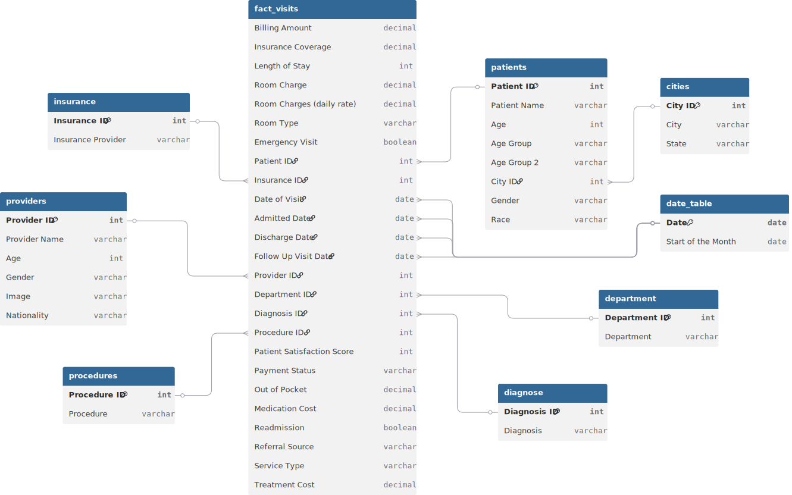

# 📊 Project Background: St. Jude Metropolitan's Operational Recovery

**St. Jude Metropolitan** is a leading multi-specialty hospital where clinical excellence must meet operational precision. In a high-stakes environment where "time is muscle," the hospital’s ability to deliver care was being compromised by systemic administrative friction and poor resource allocation.

**The mission was to spearhead a Strategic Operational Recovery.** St. Jude was grappling with a critical "Satisfaction Crisis," where an inequitable distribution of clinical labor caused the average patient satisfaction score to plummet to a dangerously low **3.84/10**. I was brought in to engineer a data-backed workload redistribution model, transforming 5,000 fragmented visit records into an actionable framework to eliminate clinician burnout and stabilize the hospital’s reputation.

Insights and recommendations are provided on the following key areas:

* **Clinical Efficiency & Flow** (Admission Rates & Length of Stay)
* **Provider Performance Matrix** (Balancing Workload vs. Patient Satisfaction)
* **Financial Health & Insurance** (Revenue Drivers & Coverage Gaps)
* **Patient Demographics & Experience** (Understanding the "Who" and the "How")

https://github.com/user-attachments/assets/7c0d76e4-fccd-4d57-94b5-d6705a09fae1

**PowerQuery M Code regarding data preparation process ovarious tables f can be found [[here]](https://github.com/mehedibhai101/Healthcare_Analytics_and_Operational_Efficiency/tree/main/Data%20Cleaning).**

**DAX queries regarding various analytical calculations can be found [[here]](https://github.com/mehedibhai101/Healthcare_Analytics_and_Operational_Efficiency/tree/main/DAX%20Calculations).**

**An interactive Power BI dashboard used to report and explore sales trends can be found [[here]](https://app.powerbi.com/view?r=eyJrIjoiMDk1Y2M2MmItNmVhOS00Y2EzLWFlZjctNjU5ZWM1N2IzYTE0IiwidCI6IjAwMGY1Mjk5LWU2YTUtNDYxNi1hNTI4LWJjZTNlNGUyYjk4ZCIsImMiOjEwfQ%3D%3D).**

---

# 🏗️ Data Structure & Initial Checks

The healthcare analytics engine is built on a robust, normalized schema connecting **8 relational tables** with a total of **5,000 visit records**.

* **`Visits`:** The core transaction table tracking `Patient_ID`, `Provider_ID`, `Treatment_Cost`, and `Medication_Cost`.
* **`Patients`:** Demographic profiles for 4,973 individuals, including `Age`, `Gender`, and `Race`.
* **`Providers`:** A roster of 5 key physicians, tracking their `Specialty` and `Nationality`.
* **`Departments`:** Segmentation across Cardiology, Orthopedics, General Surgery, Neurology, and Pediatrics.
* **`Insurance` & `Procedures`:** Lookup tables detailing payer information (Aviva, AXA, Allianz) and medical treatments (CT Scan, MRI, etc.).

### 🗺️ Entity Relationship Diagram


---

# 📋 Executive Summary

### Overview of Findings

The hospital manages a high-volume operation with **5,000 annual visits** and **$3.17M in total revenue**. However, operational friction is evident. While **Cardiology** leads in revenue generation, **Pediatrics** lags significantly. A critical disparity exists in provider performance: **Dr. Sade Kikiola** handles the highest volume (1,875 visits) but suffers from the lowest patient satisfaction score (2.35), indicating a dangerous trade-off between "quantity of care" and "quality of care." Conversely, **Dr. Olu Abisola** maintains the highest satisfaction (5.45) despite a heavy workload, setting the benchmark for clinical excellence.

---

# 🔍 Insights Deep Dive

### 🏥 Clinical Efficiency & Flow

* **The 24.9% Admission Rate.** Nearly one-quarter of all visits result in inpatient admission. This high rate places significant pressure on bed capacity and resource allocation.
* **Length of Stay (LOS) Consistency.** The Average Length of Stay is **4.9 days**. Monitoring this metric is crucial; deviations (e.g., >7 days) often indicate complications or discharge inefficiencies.
* **Departmental "Heavy Lifters."** **Cardiology ($681K)** and **Orthopedics ($622K)** are the primary revenue engines, together accounting for over 40% of total treatment costs.
* **Emergency vs. Elective.** Emergency visits account for **38.6%** of total traffic, demanding a flexible staffing model that can handle unpredictable surges.

[**Visualization: Admission Rate Trend & Average Length of Stay by Dept**]

### 👨‍⚕️ Provider Performance Matrix

* **The "Burnout" Risk.** **Dr. Sade Kikiola** is carrying a disproportionate load, managing **37% of all patient visits**. This volume directly correlates with her surprisingly low satisfaction score (2.35).
* **The "Gold Standard."** **Dr. Olu Abisola** strikes the perfect balance, managing a high volume (1,358 visits) while achieving the highest satisfaction score (5.45).
* **Specialist Satisfaction.** Specialists with lower patient volumes, like **Dr. Emma Jones** (467 visits) and **Dr. Johnson Grek** (445 visits), maintain high satisfaction scores (>4.8), suggesting that lower patient-to-doctor ratios yield better perceived care.
* **Referral Patterns.** A significant portion of traffic comes from **Self-Referrals**, indicating a strong hospital brand, but also a need to strengthen the "Physician Referral" network for specialized cases.

[**Visualization: Provider Volume vs. Satisfaction Scatter Plot**]

### 💳 Financial Health & Insurance

* **Revenue Distribution.** Total revenue stands at **$3.17M**. **Cardiology** is the most lucrative department, while **Pediatrics** generates the least revenue ($333K), likely due to lower procedure costs.
* **Payer Parity.** Insurance coverage is remarkably balanced across the three major providers: **Aviva ($751K)**, **AXA ($743K)**, and **Allianz ($731K)**. This lack of dependency on a single payer reduces financial risk.
* **Out-of-Pocket Exposure.** A significant portion of billing remains "Pending" (38.3%), highlighting a potential cash flow bottleneck in the revenue cycle management (RCM) process.

[**Visualization: Revenue by Department & Insurance Coverage Breakdown**]

### 👥 Patient Demographics & Experience

* **The "Middle-Age" Core.** The patient base is heavily skewed towards the **40-60 age demographic**, which aligns with the high volume in Cardiology and Orthopedics.
* **Satisfaction drivers.** The overall average satisfaction score is **3.84/10**, which is critically low for a healthcare institution. This is primarily dragged down by the high-volume/low-satisfaction performance of a single provider.
* **Racial & Gender Diversity.** The patient population is diverse, requiring culturally competent care strategies, particularly in the high-traffic General Surgery and Orthopedics departments.

[**Visualization: Patient Age Distribution & Satisfaction Score Trend**]

---

# 🚀 Recommendations:

* **Workload Rebalancing:** Immediately redistribute patient load from **Dr. Sade Kikiola** to underutilized providers like **Dr. Emma Jones** and **Dr. Johnson Grek**. This will likely improve Dr. Kikiola's satisfaction scores by reducing burnout.
* **Pediatric Service Audit:** Investigate the low revenue in **Pediatrics**. Consider introducing high-value sub-specialties or marketing campaigns to boost volume and revenue per visit.
* **RCM Optimization:** Tackle the **38.3% "Pending" payment status**. Implement stricter upfront co-pay collections and automate insurance verification to accelerate cash flow.
* **"Patient First" Training:** Launch a soft-skills training program for high-volume providers. Modeling the patient interaction techniques of **Dr. Olu Abisola** could lift the overall hospital satisfaction score above the 4.0 threshold.
* **Bed Capacity Planning:** With a **24.9% admission rate**, ensure that inpatient bed availability aligns with the "Emergency" surge patterns to prevent bottlenecks in the ER.

---

## ⚠️ Assumptions and Caveats:

* **Revenue Calculation:** "Total Revenue" is calculated as the sum of `Treatment Cost` + `Medication Cost`. Room charges and other ancillary fees were excluded unless explicitly stated.
* **Satisfaction Scoring:** The "Patient Satisfaction Score" is treated as a continuous variable (1-10 scale). A score of 0 or null was excluded from the average calculation.
* **Visit Granularity:** Analysis assumes each row in the `visits` table represents a unique, completed patient interaction. Cancelled or "No-Show" appointments are not factored into the volume metrics.
* **Provider Assignment:** It is assumed that the `Provider ID` listed is the primary physician responsible for the care episode, even if multiple doctors were involved.

---

## 📂 Repository Structure

```
Advanced_End-to-End_Retial_Analytics/
│
├── Dashboard/                             # Final visualization and reporting outputs
│   ├── assets/                            # Visual elements used in reports (logos, icons, etc.)
│   │   ├── Icons/                         # Collection of icons used in KPI Cards/Buttons
│   │   │   ├── Buttons/
│   │   │   └── KPIs/
│   │   ├── logo.png                       # Brand logo of St. Jude Metropolitan
│   │   └── Theme.json                     # Custom Power BI color palette for dashboard
│   │
│   ├── live_dashboard.md                  # Links to hosted Power BI Service report
│   └── static_overview.pdf                # Exported PDF version of the final dashboard for quick viewing
│
├── Data Cleaning/                         # Power Query M Codes for cleaning tables of the dataset.
│
├── Dataset/                               # The data foundation of the project
│   ├── entity_relationship_diagram.svg    # Visual map of table connections and cardinality
│   ├── cities.csv                         # Geographic mapping for patient population analysis
│   ├── department.csv                     # Hospital units and clinical cost centers
│   ├── diagnose.csv                       # Clinical diagnosis codes used to identify patient health trends
│   ├── insurance.csv                      # Payer data for analyzing reimbursement and claim cycles
│   ├── patients.csv                       # Demographic master data for patient risk stratification
│   ├── procedures.csv                     # Log of medical services performed and resource utilization
│   ├── providers.csv                      # Medical staff profiles to track performance and care delivery
│   └── visits.csv                         # Core encounter logs used to analyze patient flow and throughput
│
├── DAX Calculations/                      # Business logic and analytical formulas
│   ├── calculated_column.md               # Definitions for static row-level logic (e.g., hour buckets)
│   └── measures.md                        # Dynamic aggregation formulas (e.g., Total Revenue, MoM Growth)
│
├── LICENSE                                # Legal terms for code and data usage
└── README.md                              # Project background, summary and key insights
``` 

---

## 🛡️ License

This project is licensed under the [MIT License](LICENSE). You are free to use, modify, and distribute it with proper attribution.

---

## 🌟 About Me

Hi! I’m **Mehedi Hasan**, well known as **Mehedi Bhai**, a Certified Data Analyst with strong proficiency in *Excel*, *Power BI*, and *SQL*. I specialize in data visualization, transforming raw data into clear, meaningful insights that help businesses make impactful data-driven decisions.


Let’s connect:

[](https://www.linkedin.com/in/mehedi-hasan-b3370130a/)
[](https://youtube.com/@mehedibro101?si=huk7eZ05dOwHTs1-)
